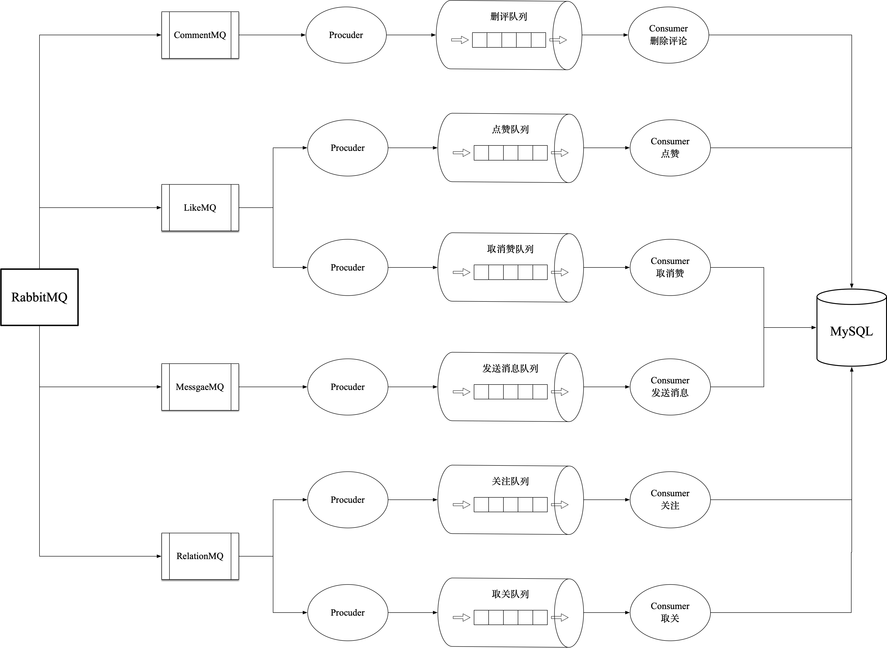

# Tiny-TikTok


<div align="center">

</div>

## 目录
- [使用说明](#使用说明)
    - [项目依赖](#项目依赖)
    - [项目配置](#项目配置)
- [文件目录说明](#文件目录说明)
- [项目整体设计](#项目整体设计)
   - [系统架构图](#系统架构图)
   - [数据库设计](#数据库设计)
   - [Redis 架构设计](#Redis 架构设计)
   - [RabbitMQ 架构设计](#RabbitMQ 架构设计)
- [性能测试](#性能测试)
## 使用说明

### 项目依赖

tiny-tiktok 的项目依赖如下：

```
require (
	github.com/brianvoe/gofakeit/v6 v6.20.1  // 虚拟数据生成
	github.com/gin-contrib/pprof v1.4.0  // 性能测试
	github.com/gin-gonic/gin v1.8.2  // 后端框架
	github.com/golang-jwt/jwt/v4 v4.4.3  // jwt鉴权
	github.com/importcjj/sensitive v0.0.0-20200106142752-42d1c505be7b  // 敏感词过滤
	github.com/jlaffaye/ftp v0.1.0  // ftp传输
	github.com/linvon/cuckoo-filter v0.4.0  // 布谷鸟过滤器
	github.com/streadway/amqp v1.0.0  // 消息队列
	golang.org/x/crypto v0.0.0-20220214200702-86341886e292  // 密码加密
	gorm.io/driver/mysql v1.4.5  // 数据库
	gorm.io/gorm v1.24.3  // ORM库
)
```

使用如下命令安装：

```bash
go mod download
```

项目运行：

```bash
go run main.go router.go
```

### 项目配置

#### 配置文件说明

本项目的所有配置都放在 config.go 中，出于安全考虑并未上传到项目中，该文件包含内容如下：

```go
package config

// SSH配置
var Ssh_addr_port = "" // 服务器IP + SSH端口号(22)
var Ssh_username = "" // 用户名
var Ssh_password = "" // 密码
var Ssh_max_taskCnt = 100 // 最大连接数

// FTP
var Ftp_addr_port = "" // 服务器IP + FTP端口号(21)
var Ftp_video_path = "" // 服务器上的视频存储路径
var Ftp_image_path = "" // 服务器上的图片存储路径
var Ftp_username = "" // 用户名
var Ftp_password = "" // 密码
const Ftp_max_concurrent_cnt = 20 //Ftp并发处理的文件上限

// 服务器
var Url_addr = "" // 服务器IP
// 访问重定向
var Url_Play_prefix = "/videos/" // 视频存放地址
var Url_Image_prefix = "" // 图片存放地址

// MySQL
var MySQL_username = "" // 用户名
var MySQL_password = "" // 密码
var MySQL_IP = "" // 本机IP｜服务器IP
var MySQL_host = "" // MySQL端口号
var MySQL_database = "" // 数据库

// Redis
var Redis_addr_port = "" // 本机IP｜服务器IP + Redis端口号
var Redis_password = "" // 密码

// RabbitMQ
var RabbitMQ_username = "" // 用户名
var RabbitMQ_passsword = "" // 密码
var RabbitMQ_IP = "" // 本机IP｜服务器IP
var RabbitMQ_host = "5672" // RabbitMQ端口号
```

#### FTP

**安装**

```bash
# Mac
yum install vsftpd
# Linux
## Ubuntu
apt-get install vsftpd 
## CentOS
yum install vsftpd
```

**配置**

```bash
vim vsftpd.conf  # 配置文件路径自行查看 

# 修改配置如下
listen=YES
listen_port=21
listen_ipv6=NO
local_root=""  # 指定访问路径
write_enable=YES  # 写权限必须打开
idle_session_timeout=0  # 不会杀死空闲连接
```

**启动**

```bash
service vsftpd restart
```

**测试**

在服务器上安装配置重启后，本地使用如下指令测试连接：

```bash
ftp 服务器IP地址
```

或者进入到 `/tiny-tiktok/middleware/ftp/` 目录下运行测试文件：

```bash
go test ftp_test.go
```

#### FFmpeg

**安装**

```bash
# Linux
## Ubuntu
apt-get install ffmpeg
## CentOS 需进入官网下载上传编译 https://ffmpeg.org/download.html
```

**测试**

1. 修改 config.go 文件下变量 Ssh_addr_port、Ssh_username、Ssh_password 为自己服务器对应的参数
2. 创建 config.go 文件下变量 Ftp_video_path、Ftp_image_path 对应的路径（可自定义）
3. 将 data 目录下的 bear.mp4 文件放在 config.go 文件的 Ftp_video_path 对应的路径下
4. cd 到 ffmpeg 文件夹下 `go test ffmpeg_test.go `
5. Ftp_image_path 路径下出现 bear.jpg 和 bear2.jpg 文件则配置成功

#### Nginx

**安装**

略

**配置**

```sh
vim nginx.conf

# 增加如下字段后保存
# 访问重定向
location ^~ /videos/ {
    root Ftp_video_path;
}
location ^~ /images/ {
    root Ftp_image_path;
}

# 切换到nginx可执行文件目录
/usr/local/nginx/sbin

# 重新加载配置
./nginx -s reload
```

#### MySQL

MySQL 的安装配置过于经典，此处略过⏭

#### Redis

**安装**

官网下载安装包解压即可

**启动/测试**

```bash
redis-server
ping # 返回 PONG
```

#### RabbitMQ

**安装**

```bash
# Linux
apt-get install rabbitmq-server
# Mac
brew intsall rabbitmq-server
```

**启动**

```bash
rabbitmq-server
```

## 文件目录说明
```
tiktok 
├── /config/ 配置文件包
├── /controller/ 控制器包
├── /dao/ 数据库访问
├── /images/ 图片引用
├── /middleware/ 中间件
│   ├── ffmpeg/ 视频截图
│   ├── ftp/ 文件服务器
│   ├── jwt/ 鉴权
│   ├── rabbitmq/ 消息队列
│   ├── redis/ 缓存
├── /service/ 服务层
├── /util/ 工具
├── .gitignore
├── /go.mod/
├── LICENSE
├── main.go
├── README.md
└── router.go
```


## 项目整体设计

### 系统架构图


### 数据库设计


### Redis 架构设计


### RabbitMQ 架构设计




## 性能测试

**安装 graphviz**

```bash
apt-get install graphviz
```

**生成火焰图**

```bash
# 执行命令后,会在浏览器打开一个窗口
go tool pprof -http=:1234 http://localhost:8080/debug/pprof/goroutine
```

